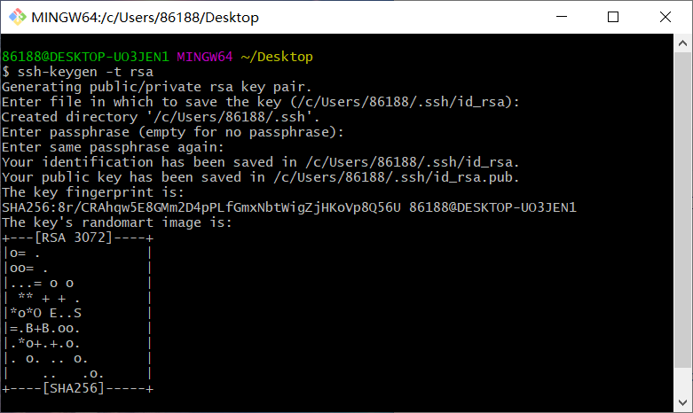
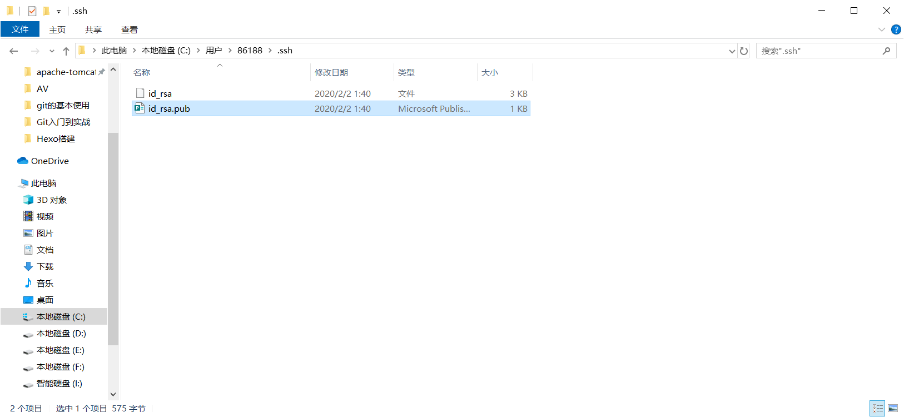
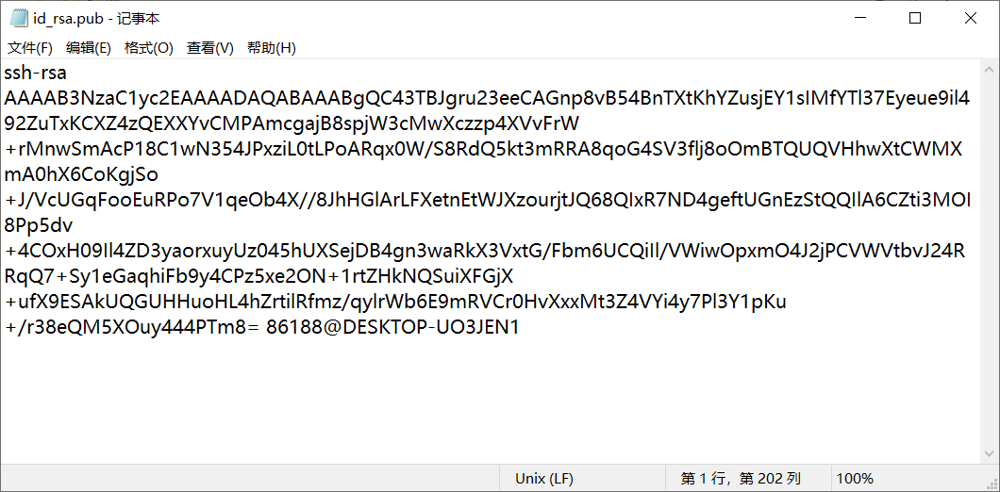
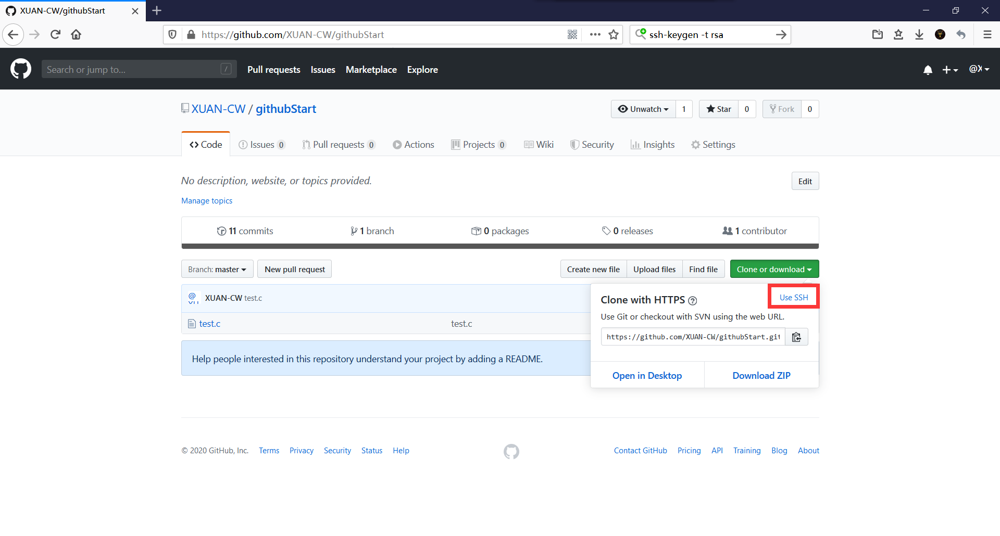
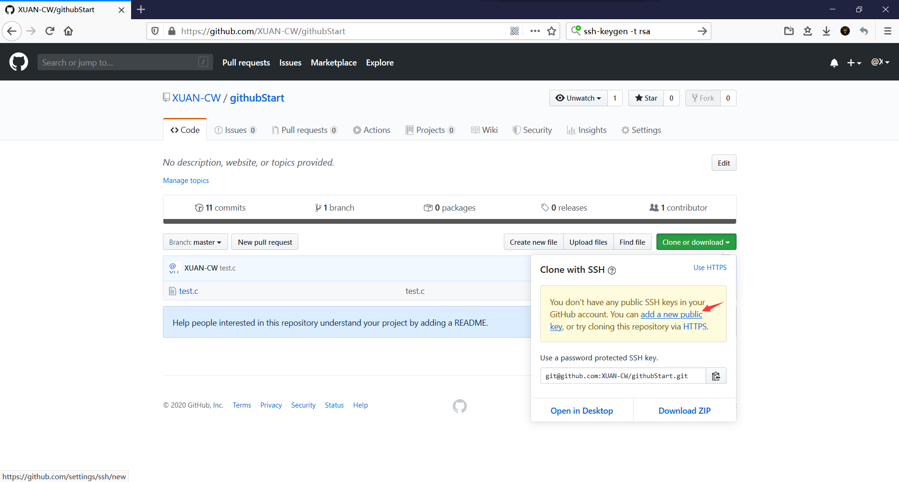
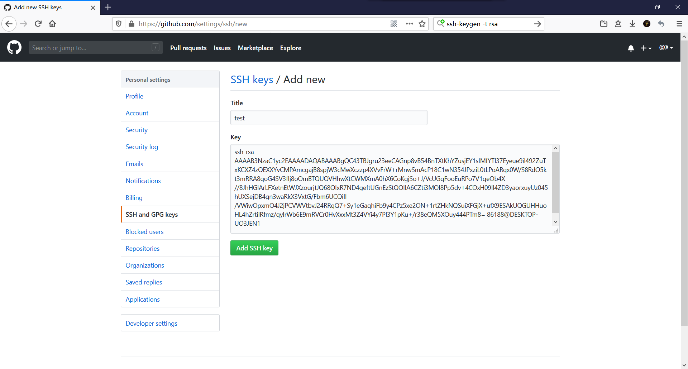
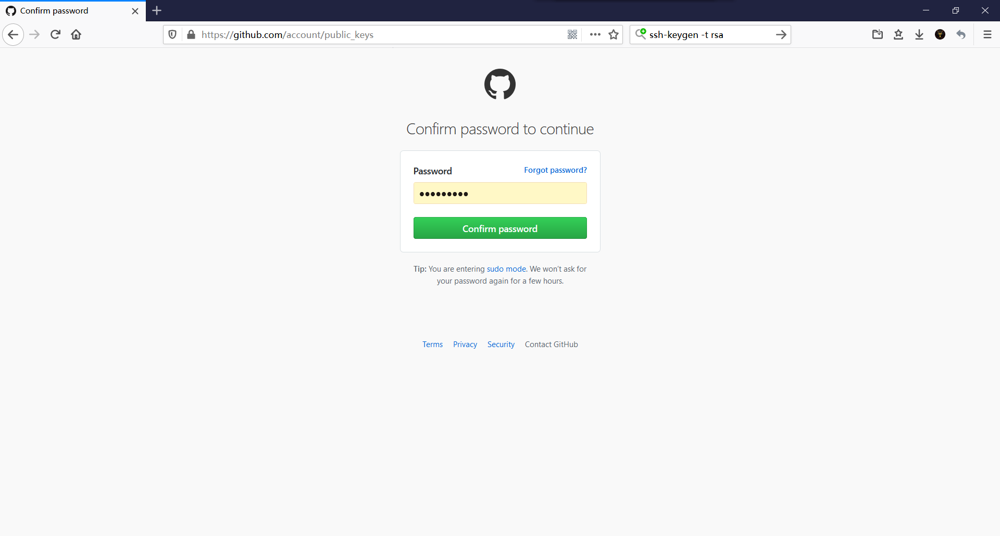
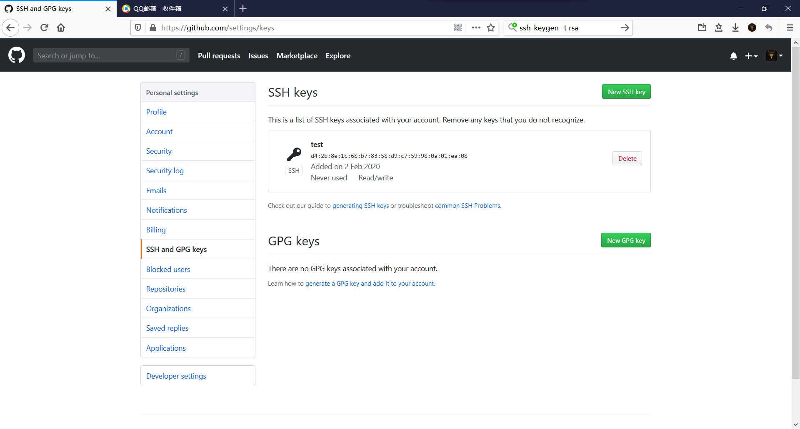
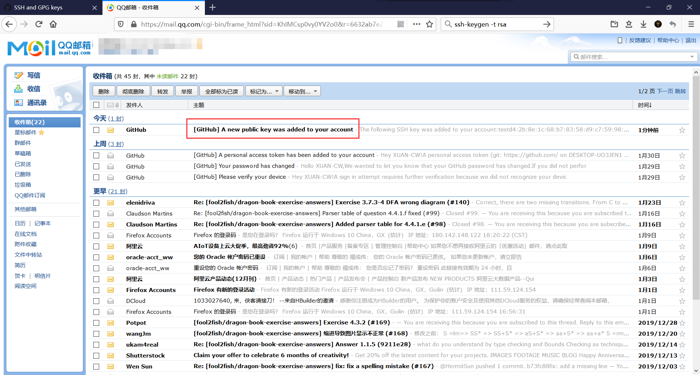

# 概述


打开 git bush 使用 ssh-keygen -t rsa 建立公钥

```
ssh-keygen -t rsa
```

建立之后一路回车即可，若要更改私钥路径、设置密码，可在此处进行操作




根据上面的路径找到文件 **id_rsa.pub** ，用记事本打开，不要使用 Microsoft Publisher 打开





复制内容，一个字符都不要动！

打开GitHub，进入仓库，在 Clone or dowmload 处点击 **Use SSH** 



点击 **add new pubilc key**，进入公钥设置页面



填写标题与刚才复制的公钥，标题随意，但公钥一个字符都不能动！



输入密码确认




成功后会出现这样的页面，并且你的邮箱会收到一封来自GitHub的邮件






