# 字体设置


# 编码设置

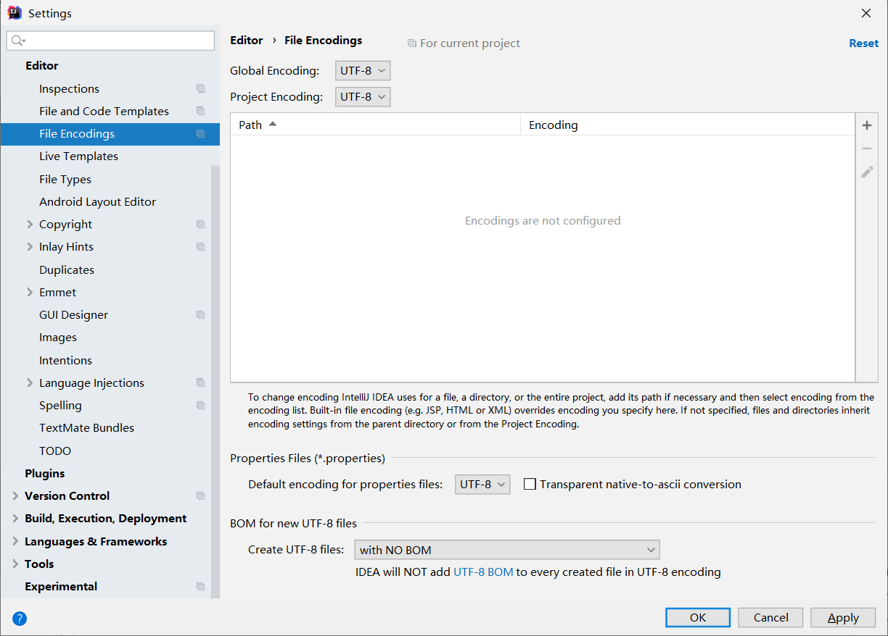

# 控制台字体设置


# 模板设置


# 自动导包

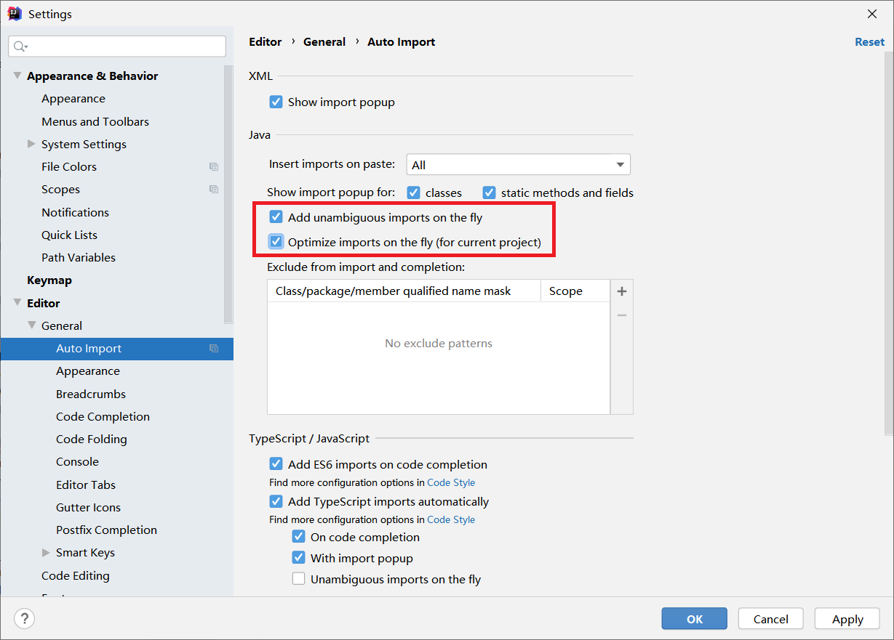

# 多行显示tabs

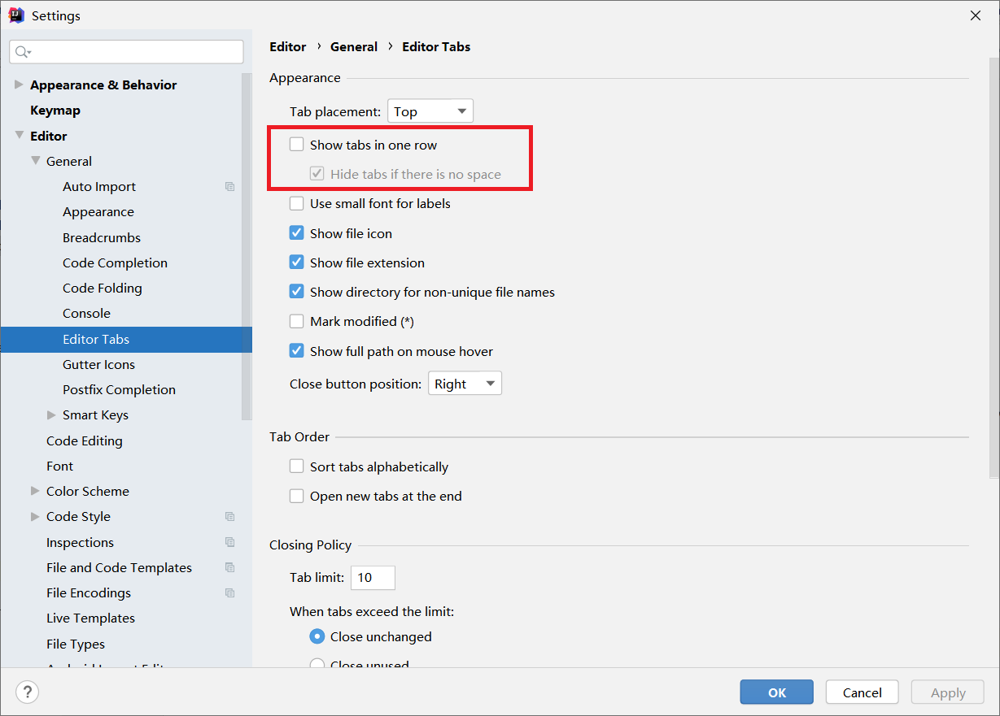

# 注释颜色

```
20894D
```

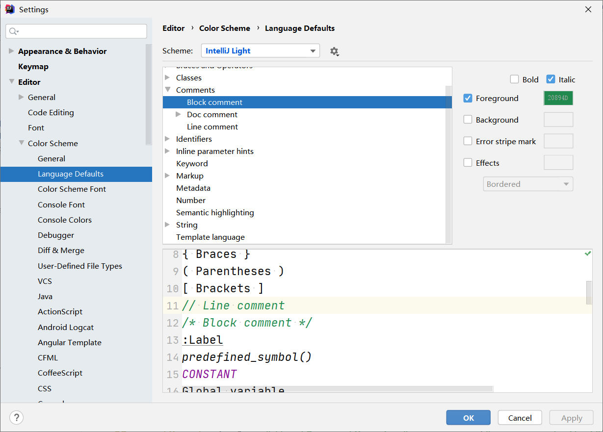

```
15559A
```

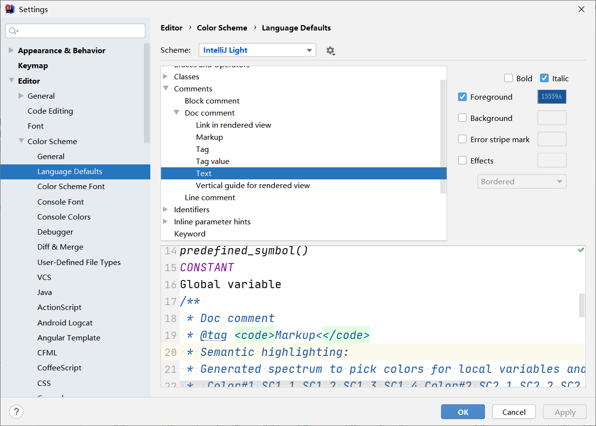

# 头部信息

```java
/** 
@author 禤成伟
@since ${YEAR}-${MONTH}-${DAY} ${TIME}
*/
```

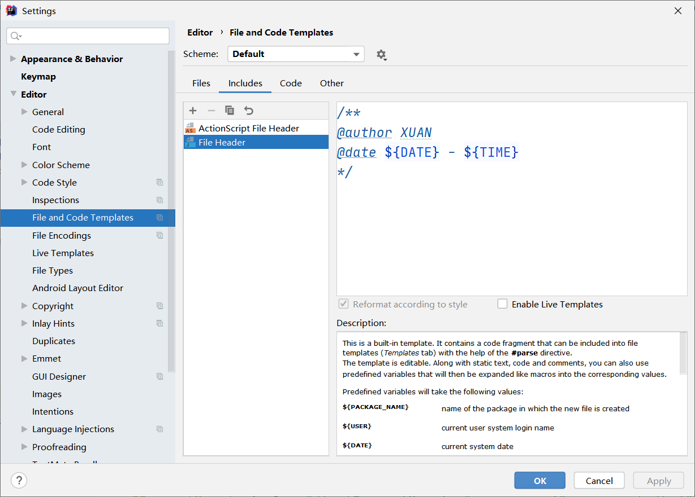

# 统一设置为 UTF-8

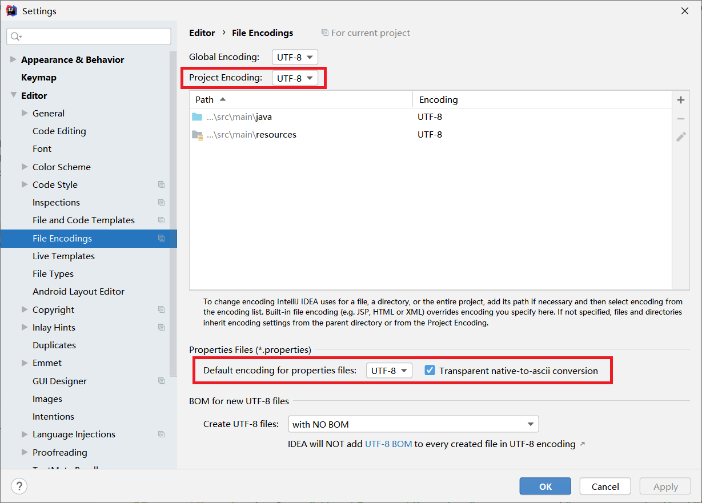

# 自动编译

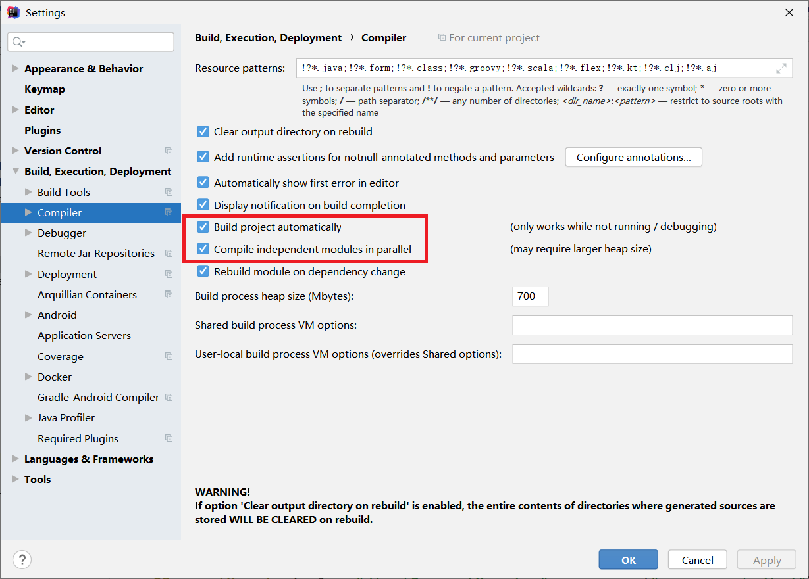


# 方法注释

## 参考

 [idea设置方法注释](assets\references\idea设置方法注释.html) 

## 三个重要参数

```
* 
 * 
 $param$
 return
 */
```

```
groovyScript("if(\"${_1}\".length() == 2) {return '';} else {def result=''; def params=\"${_1}\".replaceAll('[\\\\[|\\\\]|\\\\s]', '').split(',').toList();for(i = 0; i < params.size(); i++) {if(i==0){result+='* @param ' + params[i]}else{result+='\\n' + ' * @param ' + params[i]}}; return result;}", methodParameters());
```

```
groovyScript("def returnType = \"${_1}\"; def result = '* @return ' + returnType; return result;", methodReturnType());
```

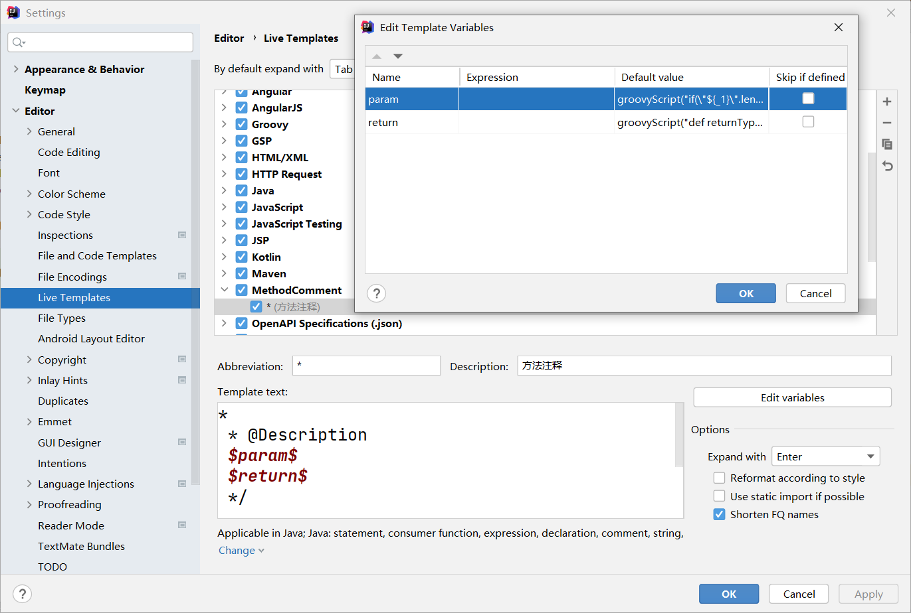

## 作用范围


# 设置 project 显示


# terminal

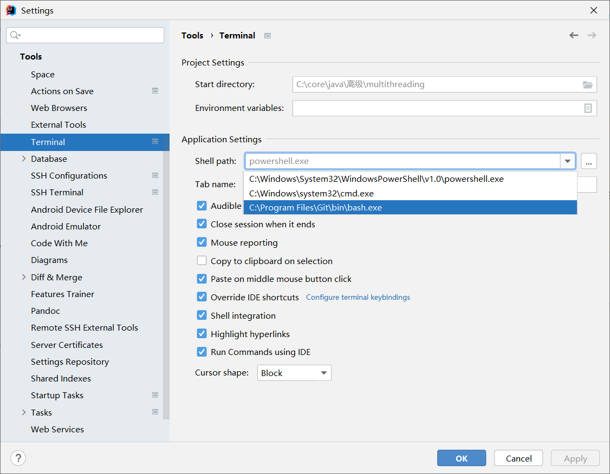


# Idea使用系统应用打开md文件

我想双击用本地应用打开 markdown 文件，但网上的怎么找都找不到。

我在 idea 中双击 mp4 文件，他就直接本地应用播放了，所以就在想，能让 MP4 直接本地应用打开，那应该也可以让能让 md 直接本地应用打开。于是我直接从 IDEA 导出  **settings.zip**，解压后检索 `mp4` ,于是在   [settings\options\filetypes.xml](assets\data\filetypes.xml) 中找到了  `mp4`  ：

```xml
<application>
  <component name="FileTypeManager" version="18">
    <extensionMap>
        ... ...
      <mapping ext="mp4" type="Native" />
        ... ...
    </extensionMap>
  </component>
</application>
```

依葫芦画瓢，我添加了一条 `mapping` ，变成了下面这样：

```xml
<application>
  <component name="FileTypeManager" version="18">
    <extensionMap>
        ... ...
      <mapping ext="mp4" type="Native" />
        <mapping ext="md" type="Native" />
        ... ...
    </extensionMap>
  </component>
</application>
```

再打开 idea ，就可以用本地应用打开 markdown 了

# maven指定

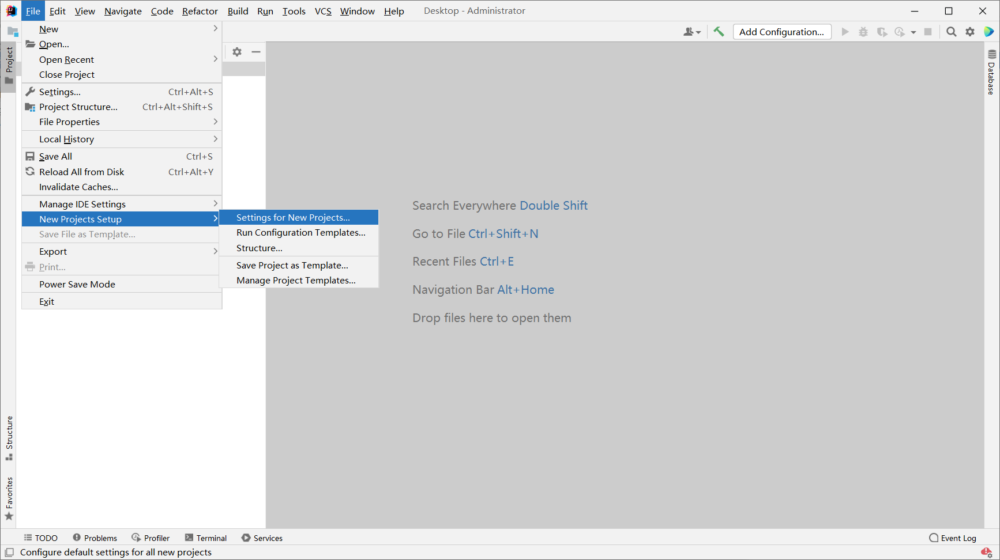

# springboot initializr 加速

把原来的

```
https://start.spring.io
```

改成：

```
https://start.aliyun.com/
```

或：

```
https://start.springboot.io/
```

# 插件安装

- Alibaba Java Coding Guidelines
- Codota


