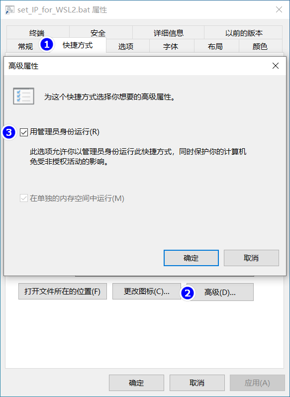
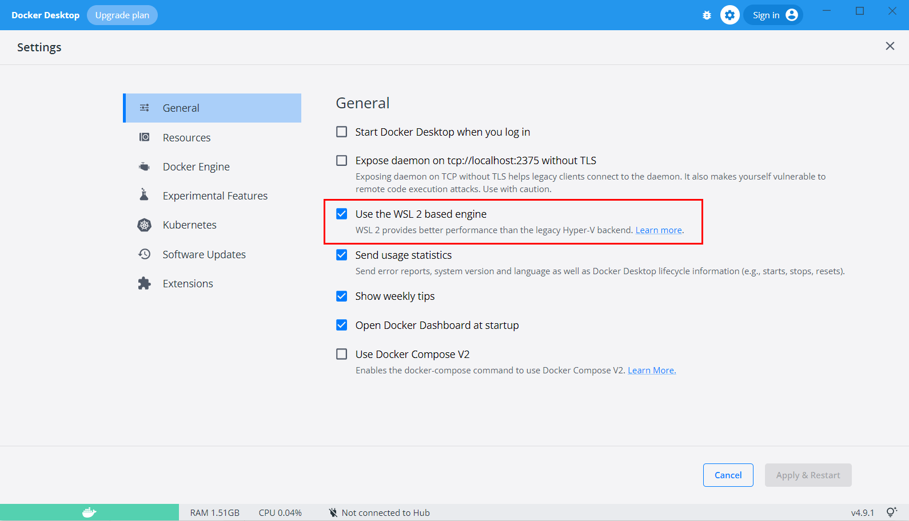
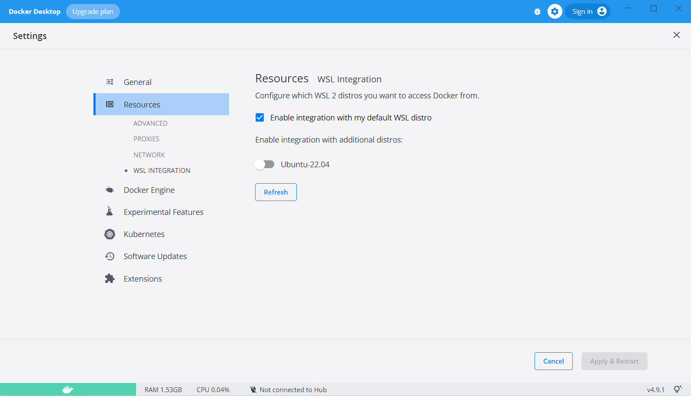
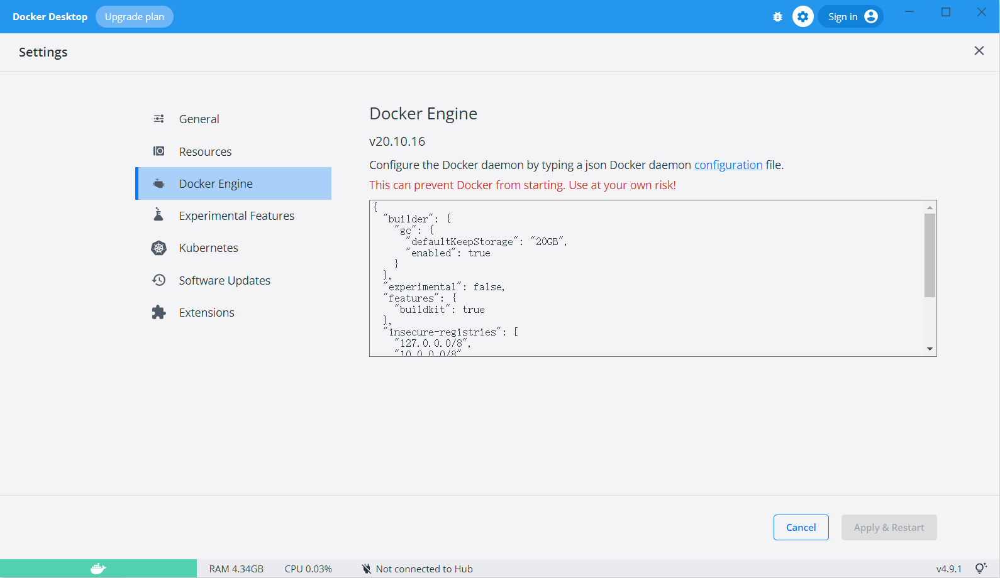

# 摘要

参考 [WSL2 _ Docker _ xfce4安装及使用.html](assets\references\WSL2 _ Docker _ xfce4安装及使用.html) 

# 步骤

## 更新windows

如果你的系统是win10，那最好先更新一下，以免出什么意外。 [windows操作系统怎么更新，如何更新电脑系统.html](assets\references\windows操作系统怎么更新，如何更新电脑系统.html) 

## 启用虚拟机平台

任务栏搜索 `Windows 功能` ，勾选两项：

1. 适用于 Linux 的 Windows 子系统
2. 虚拟机平台

## 启用"虚拟机平台"可选组件

**管理员**身份打开powershell

```
dism.exe /online /enable-feature /featurename:VirtualMachinePlatform /all /norestart
```

## wsl2设置为默认

**管理员**身份打开powershell

```
wsl --set-default-version 2
```

## 安装linux分发版

[Ubuntu 20.04 LTS](https://www.microsoft.com/store/apps/9n6svws3rx71) 

## WSL2问题解决 WslRegisterDistribution failed with error

https://blog.csdn.net/qq_18625805/article/details/109732122

# WSL2设置静态IP

参考 [WSL2设置静态IP.html](assets\references\WSL2设置静态IP.html)  [给wsl2的ubuntu分配固定IP，优化windows开发环境.html](assets\references\给wsl2的ubuntu分配固定IP，优化windows开发环境.html) ，设置

## 脚本

```
:: set_IP_for_WSL2.bat
    @echo off
    setlocal enabledelayedexpansion
    ::先停掉可能在跑的wsl实例
    wsl --shutdown ubuntu
    if !errorlevel! equ 0 (
        ::检查WSL有没有我需要的IP
        wsl -u root ip addr | findstr "192.168.2.100" > nul
        if !errorlevel! equ 0 (
            echo wsl ip has set
        ) else (
            ::IP不存在则绑定IP
            wsl -u root ip addr add 192.168.2.100/24 broadcast 192.168.2.255 dev eth0 label eth0:1
            echo set wsl ip success: 192.168.2.100
        )
        ::检查宿主机有没有我需要的IP
        ipconfig | findstr "192.168.2.200" > nul
        if !errorlevel! equ 0 (
            echo windows ip has set
        ) else (
            ::IP不存在则绑定IP
            netsh interface ip add address "vEthernet (WSL)" 192.168.2.200 255.255.255.0
            echo set windows ip success: 192.168.2.200
        )
    )
    pause
```

## 开机自动执行任务

方法一应该是能用的，但我失败了，我用的是方法二，成功了

### 方法一

创建快捷方式到 [StartUp](C:\ProgramData\Microsoft\Windows\Start Menu\Programs\StartUp) 即可开机自启动，注意此脚本需要用管理员身份运行



### 方法二

 参考 [Win10 如何以管理员身份设置开机自启程序.html](assets\references\Win10 如何以管理员身份设置开机自启程序.html) ，注意两点：

1. 触发器设置为登录时
2. 15秒后执行，不延时 WSL2 可能还没起动

# docker

## 下载 Docker Desktop 并安装

 https://www.docker.com/get-started/

 [历史版本](https://docs.docker.com/desktop/release-notes/)

## 在 WSL2 运行 Docker

### Use WSL 2 based engine

打开 Docker Desktop **Settings**，选择**General** 。勾选**Use WSL 2 based engine**。如果在已经支持WSL的操作系统上，安装Docker Desktop，那么这个选项是被默认选中的，无需更改。



### WSL Integration

进入 **Settings -> Resources -> WSL Integration**。手动选择后，可以在Linux中来操作Docker。



## 加速

 [Win10系统基于WSL2安装Docker问题小结.html](assets\references\Win10系统基于WSL2安装Docker问题小结.html) 

```json
{
  "builder": {
    "gc": {
      "defaultKeepStorage": "20GB",
      "enabled": true
    }
  },
  "experimental": false,
  "features": {
    "buildkit": true
  },
  "insecure-registries": [
    "127.0.0.0/8",
    "10.0.0.0/8",
    "172.16.0.0/12",
    "192.168.0.0/16"
  ],
  "registry-mirrors": [
    "https://6ypv0a1a.mirror.aliyuncs.com",
    "https://registry.docker-cn.com",
    "http://hub-mirror.c.163.com",
    "https://docker.mirrors.ustc.edu.cn",
    "https://docker.mirrors.ustc.edu.cn"
  ]
}
```



# 问题解决

 [Win10 WSL2 安装Docker.html](assets\references\Win10 WSL2 安装Docker.html) 


