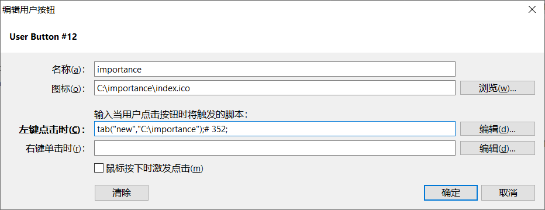
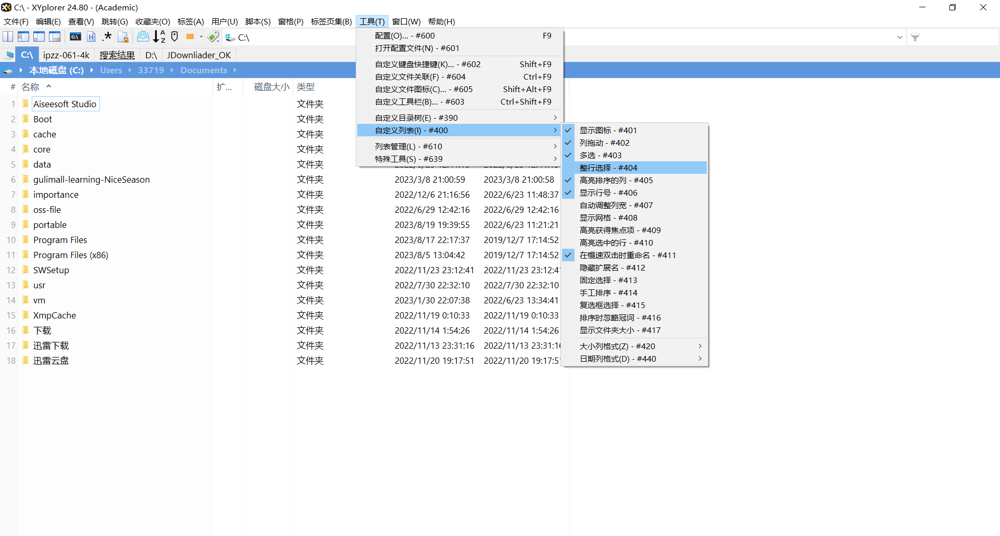
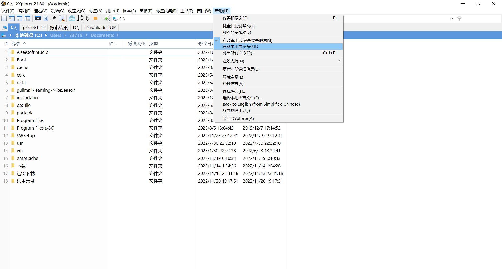
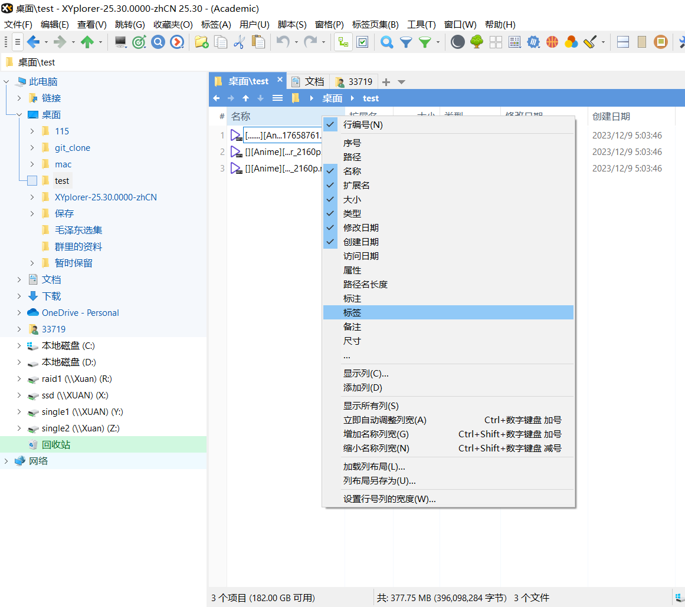
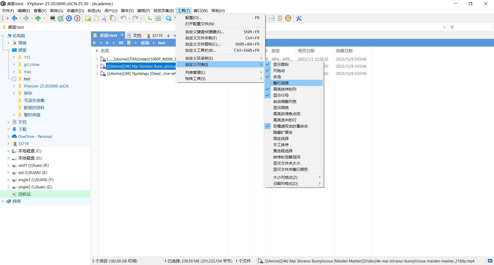
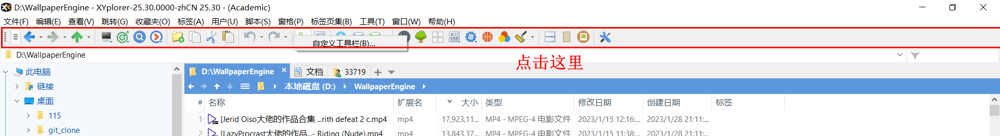
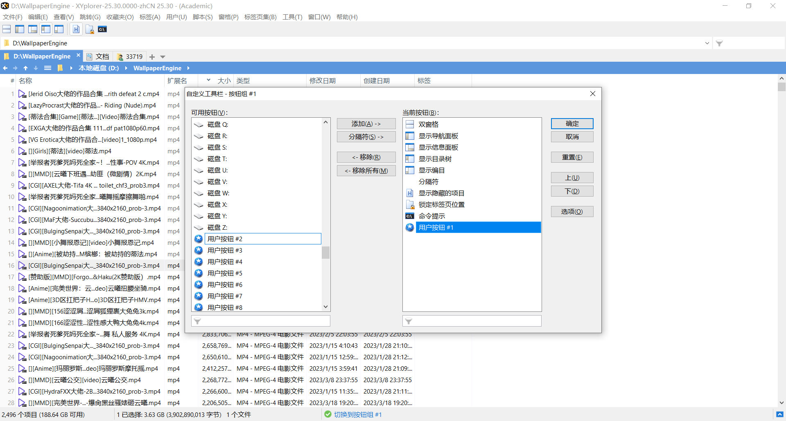
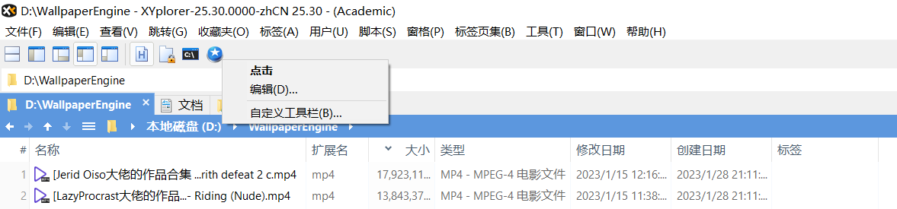
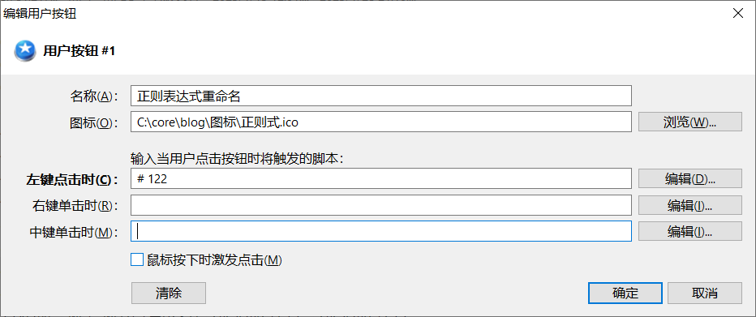
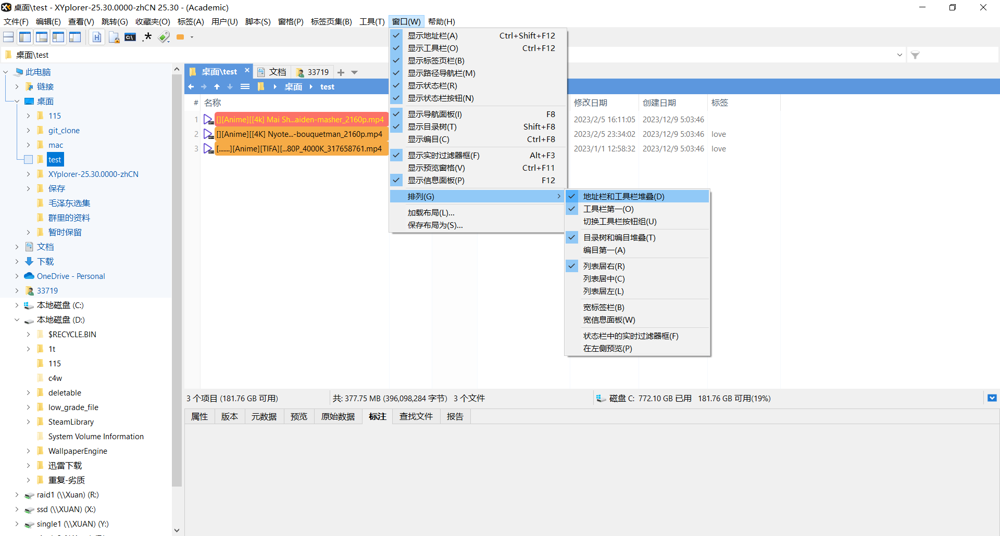

# 摘要


https://violet7pan.gitee.io/categories/XYplorer/

https://github.com/violet7pan/XYplorer_Help


# 自定义按钮

## 在新标签页中打开焦点项

```
# 352;#1007;
```


## 打开文件并关闭未锁定

```
tab("new","C:\importance");# 352;
```



# 运行脚本

```
run("C:\Users\33719\Desktop\test.sh");
```

# 整行选择




# 获取命令ID




# 显示列-显示标签




# 整行选择




# 自定义工具栏

## 打开自定义工具栏




## 常用工具


## 自定义工具-添加按钮



### 编辑按钮

右键编辑



### 填写点击效果




```
正则表达式重命名
C:\core\blog\图标\正则式.ico
# 122
```


### 正则表达式重命名

```
正则表达式重命名
C:\core\blog\图标\正则式.ico
# 122
```

### 常用路径

```
core
C:\core\index.ico
tab("new","C:\core");# 352;
```

```
java
C:\core\java\index.ico
tab("new","C:\core\java");# 352;
```

```
vm
C:\core\blog\图标\virtualBox.ico
tab("new","C:\vm");# 352;
```


### 地址栏和工具栏堆叠




