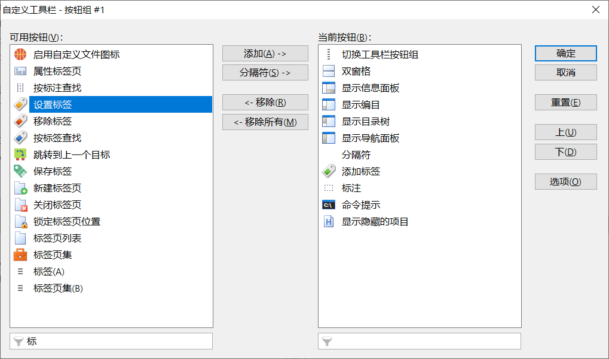
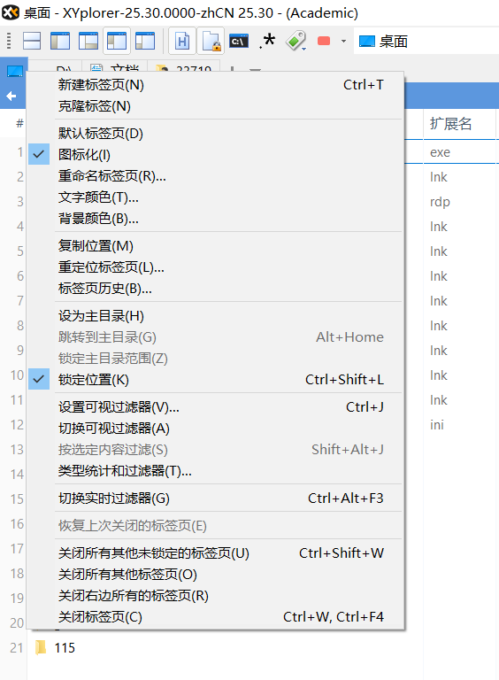
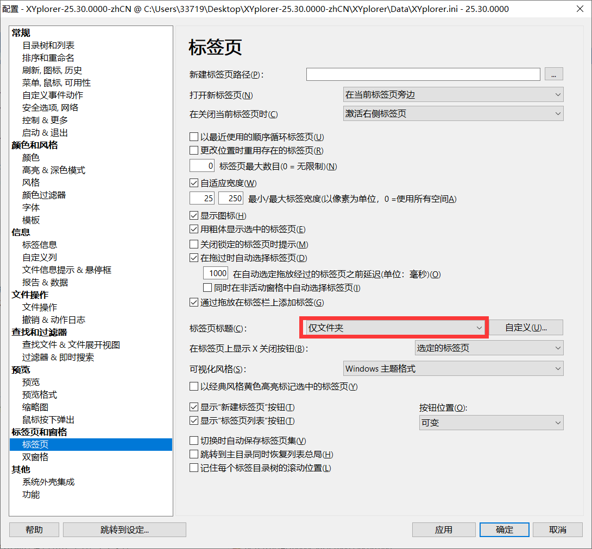
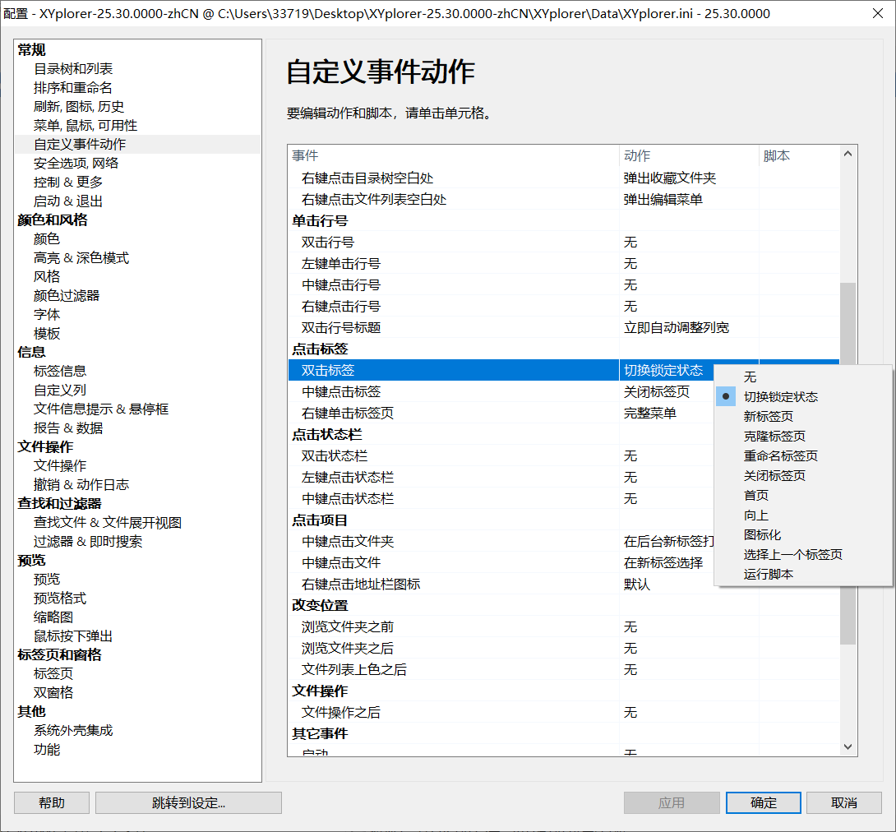
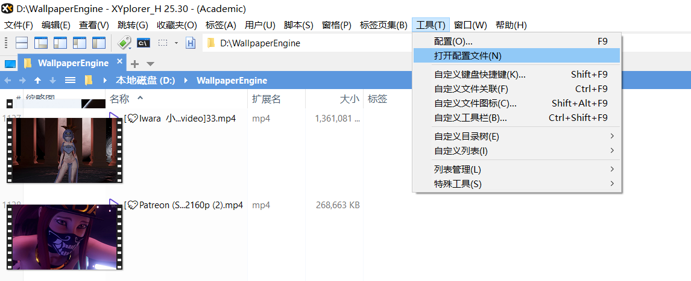

# 摘要


https://violet7pan.gitee.io/categories/XYplorer/

https://github.com/violet7pan/XYplorer_Help


# 布局


## 地址栏和工具栏堆叠


# 显示列-显示标签


# 整行选择


# 自定义工具栏

## 打开自定义工具栏


## 常用工具




## 自定义工具-添加按钮


### 编辑按钮

右键编辑


#### 填写点击效果


```
正则表达式重命名
C:\core\blog\图标\正则式.ico
# 122
```


#### 运行脚本

```
run("C:\Users\33719\Desktop\test.sh");
```


#### 获取命令ID


### 正则表达式重命名

```
正则表达式重命名
C:\core\blog\图标\正则式.ico
# 122
```

### 常用路径

```
core
C:\core\index.ico
tab("new","C:\core");# 352;
```

```
java
C:\core\java\index.ico
tab("new","C:\core\java");# 352;
```

```
vm
C:\core\blog\图标\virtualBox.ico
tab("new","C:\vm");# 352;
```


# 标签页设置

## 路径图表化、锁定位置







## 双击标签页切换锁定状态




# 设置缩略图大小


编辑配置文件



设置宽度，记得先关闭 xyplorer 后修改

```
[Thumbs]
; Tweak: comma-separated list of values used for width and height in pixels
ThumbSizes=16,32,64,96,128,192,200,300,400,600,800,1200,1600
Width=192
Height=108
```

