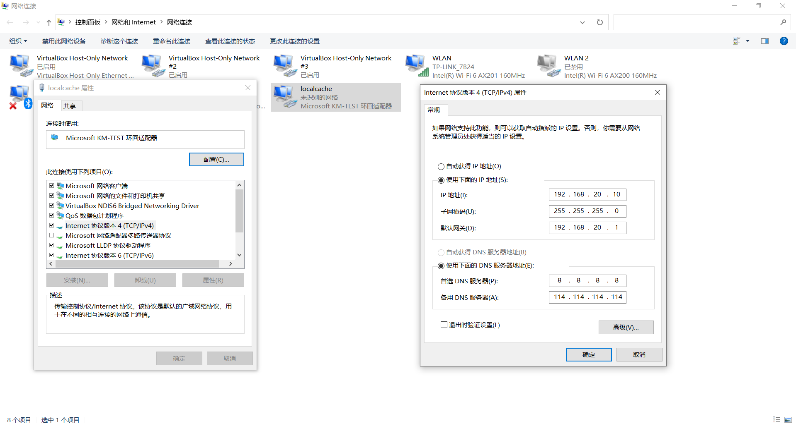

# 摘要


# 实现步骤

## win10虚拟网卡怎么设置ip地址

### 参考

 [win10虚拟网卡怎么设置ip地址.html](assets\references\win10虚拟网卡怎么设置ip地址.html) 

## 设置静态IP地址




## nginx

### 下载

- http://nginx.org/download/nginx-1.16.1.zip

### 配置

```
    server {
        listen       80;
        server_name proxy_pass_port;
        
        
        location / {
           # 域名中有 localcache，转发到 100 端口
           if ($host ~* "localcache") {  
               proxy_pass http://127.0.0.1:100;      
           }
           # 域名中有 blog，转发到 200 端口
           if ($host ~* "blog") {  
               proxy_pass http://127.0.0.1:200;      
           }
           # 默认情况
           root   /var/www/html;
           index  index.html index.htm;
        }
    }
    
    
    server {
        listen 100;
        server_name localcache;
        location / {
            root   C:/cache/software-for-development;
            index  index.html index.htm;
        }
    }
    
    server {
        listen 200;
        server_name blog;
        location / {
            root   C:/cache/blog;
            index  index.html index.htm;
        }
    }
```

### 开机自启动

创建快捷方式到 [StartUp](C:\ProgramData\Microsoft\Windows\Start Menu\Programs\StartUp) 即可开机自启动


# 可能有用的命令

## 硬链接

```
mklink /H  源文件的硬链接 源文件
```

# 规约

对于引用了本地缓存的 `.sh` 脚本命令，统一后缀为 `.localcache.sh` ，并创建硬链接到 nginx 根路径的 `localcache.sh` 文件夹下

# 虚拟机配合

```sh
echo "192.168.20.10 localcache" >> /etc/hosts
echo "192.168.20.10 article" >> /etc/hosts
```

# 快捷脚本

 [ls-wget.localcache.sh](assets\script\ls-wget.localcache.sh) 

```
mklink /H  "C:\Program Files\Git\usr\bin\ls-wget.localcache.sh" "C:\core\blog\localcache\assets\script\ls-wget.localcache.sh"
mklink /H  "C:\cache\software-for-development\ls-wget.localcache.sh" "C:\core\blog\localcache\assets\script\ls-wget.localcache.sh"
```


