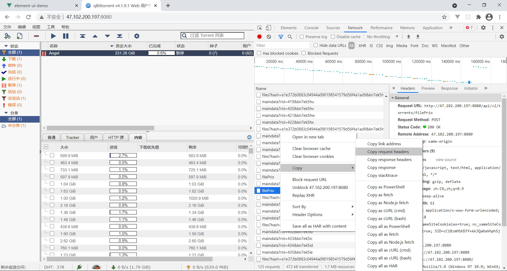

```http
POST /api/v2/torrents/filePrio HTTP/1.1
Host: 47.102.200.197:8080
Connection: keep-alive
Content-Length: 61
Accept: text/javascript, text/html, application/xml, text/xml, */*
X-Requested-With: XMLHttpRequest
User-Agent: Mozilla/5.0 (Windows NT 10.0; Win64; x64) AppleWebKit/537.36 (KHTML, like Gecko) Chrome/89.0.4389.114 Safari/537.36
Content-type: application/x-www-form-urlencoded; charset=UTF-8
Origin: http://47.102.200.197:8080
Referer: http://47.102.200.197:8080/
Accept-Encoding: gzip, deflate
Accept-Language: zh-CN,zh;q=0.9
Cookie: nc_sameSiteCookielax=true; nc_sameSiteCookiestrict=true; SID=cC1BzmHSKD7f+kk3QaNaVhphSjbwq7ZP

```

然后删掉 `POST /api/v2/torrents/filePrio HTTP/1.1`

```http
Host: 47.102.200.197:8080
Connection: keep-alive
Content-Length: 61
Accept: text/javascript, text/html, application/xml, text/xml, */*
X-Requested-With: XMLHttpRequest
User-Agent: Mozilla/5.0 (Windows NT 10.0; Win64; x64) AppleWebKit/537.36 (KHTML, like Gecko) Chrome/89.0.4389.114 Safari/537.36
Content-type: application/x-www-form-urlencoded; charset=UTF-8
Origin: http://47.102.200.197:8080
Referer: http://47.102.200.197:8080/
Accept-Encoding: gzip, deflate
Accept-Language: zh-CN,zh;q=0.9
Cookie: nc_sameSiteCookielax=true; nc_sameSiteCookiestrict=true; SID=cC1BzmHSKD7f+kk3QaNaVhphSjbwq7ZP
```

设置请求体

```
hash=e1e372b0883c04944a090198541579d56f4a1ad9&id={{btid}}&priority=0
```


