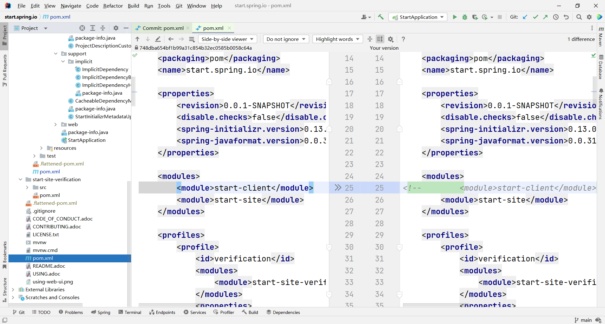
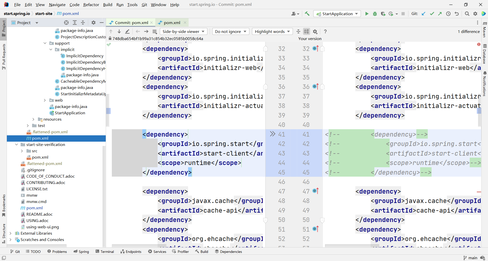
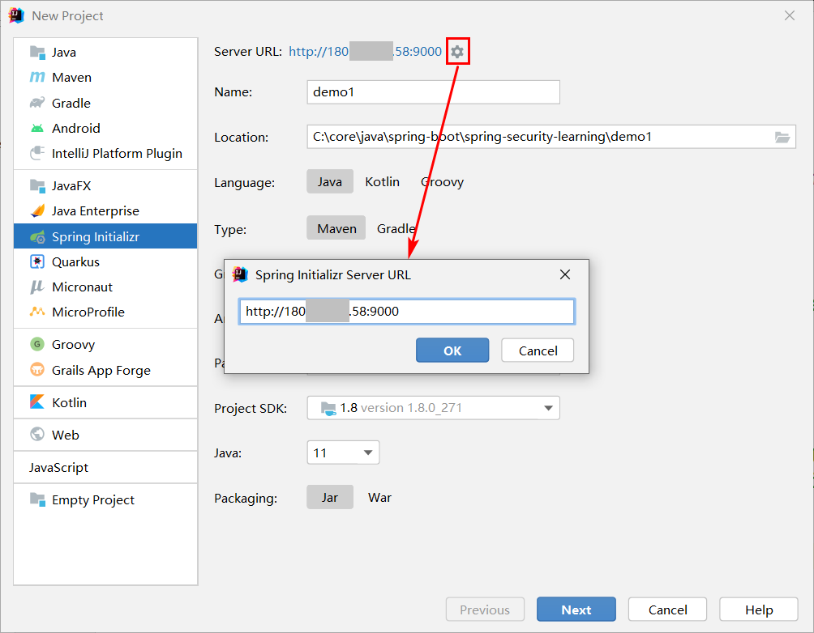

# 摘要

云服务器搭建 springboot Initializr 私服，这里我们不需要 web 界面，就单纯给 IDEA 用


```
 mvn spring-javaformat:apply
```

# 环境

1. jdk-17.0.3.1
2. apache-maven-3.6.3

# 具体实现

## clone

```sh
git clone https://github.com/spring-io/initializr.git
git clone https://github.com/spring-io/start.spring.io.git
```

## initializr

此项目install 的原因见 [搭建个人 Spring Initializr 服务器.html](搭建个人 Spring Initializr 服务器.html) ，`mvn spring-javaformat:apply` 的原因见 [Failed to execute goal io.spring.javaformat_spring-javaformat.html](assets\references\Failed to execute goal io.spring.javaformat_spring-javaformat.html) 

```
cd initializr
mvn spring-javaformat:apply
mvn clean install -DskipTests
```

## start.spring.io

```
mvn spring-javaformat:apply
mvn clean package -Dmaven.test.skip=true 
```

### 删除 start-client

start-client 需要 nodejs 打包，相当麻烦，这里我们删掉它，需要 web 界面的别删。需要执行删除操作的地方有两个：

1. start-parent
2. start-site





### package

```sh
mvn clean package -Dmaven.test.skip=true 
```

打完包之后其实就可以用了，在 target 目录下执行 `java -jar start-site-exec.jar` 运行测试一下，是没有问题的。下面是发布到服务器上的步骤，如果你找不到这个文件，可以用下面这条命令找一找：

```sh
find / -name start-site-exec.jar
```

## Docker 部署

将 start-site-exec.jar 上传到服务器后在同一目录下创建 Dockerfile ，内容如下：

```dockerfile
# FROM java:8
FROM openjdk:8-jdk-alpine
# 测试时用这个，工具比较多
# FROM openjdk:8u312-oraclelinux8
COPY start-site-exec.jar app.jar
# 这个地方要与配置文件中的 server.port 一致
EXPOSE 8080
ENTRYPOINT ["java","-jar","/app.jar"]
```

然后创建镜像：

```sh
docker image build -t springboot-initializr:1.0 -f Dockerfile .
```

最后运行：

```sh
docker run -itd -p 9000:8080 springboot-initializr:1.0
```

# IDEA 中配置

在 Server URL 中将原来的 https://start.spring.io 修改为私服地址即可



# 自定义

 [搭建自己的Spring Initializr.html](assets\references\搭建自己的Spring Initializr.html) 
