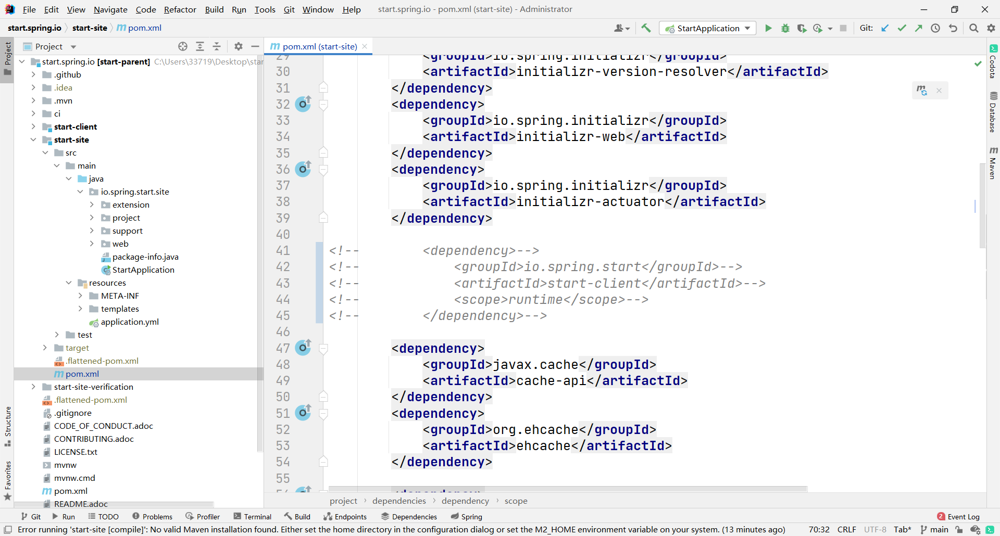

# 方法一（推荐）

云服务器搭建 springboot Initializr 私服，这里我们不需要 web 界面，就单纯给 IDEA 用的

## 步骤

### clone

```sh
git clone https://github.com/spring-io/start.spring.io.git
cd start.spring.io/
```

### 删除 start-client

start-client 需要 nodejs 打包，相当麻烦，这里我们删掉它，需要 web 界面的别删



### package

```
mvn clean package -Dmaven.test.skip=true 
```

打完包之后其实就可以用了，在 target 目录下运行 `java -jar start-site-exec.jar` 运行测试一下，是没有问题的。下面是发布到服务器上的步骤

### Docker 部署

将 start-site-exec.jar 上传到服务器后在通一目录下创建 Dockerfile ，内容如下：

```dockerfile
# FROM java:8
FROM openjdk:8-jdk-alpine
# 测试时用这个，工具比较多
# FROM openjdk:8u312-oraclelinux8
ARG JAR_FILE
COPY start-site-exec.jar app.jar
# 这个地方要与配置文件中的 server.port 一致
EXPOSE 8080
ENTRYPOINT ["java","-jar","/app.jar"]
```

然后创建镜像：

```sh
docker image build -t springboot-initializr:1.0 -f Dockerfile .
```

最后运行：

```sh
docker run -itd -p 9000:8080 springboot-initializr:1.0
```


## 参考

 [搭建自己的Spring Initializr.html](assets\references\搭建自己的Spring Initializr.html) 

# 方法二

## 启动

不废话，直接拿 [initializr-service-custom-0.9.0.zip](assets\data\initializr-service-custom-0.9.0.zip) 解压，得到 **initializr-service-custom-0.9.0.jar** ，然后运行即可

```sh
java -jar initializr-service-custom-0.9.0.jar
```


## 参考

 [本地部署SpringBootInitializr .html](assets\references\本地部署SpringBootInitializr .html) 

https://www.cnblogs.com/shishaolong/p/11757929.html 
