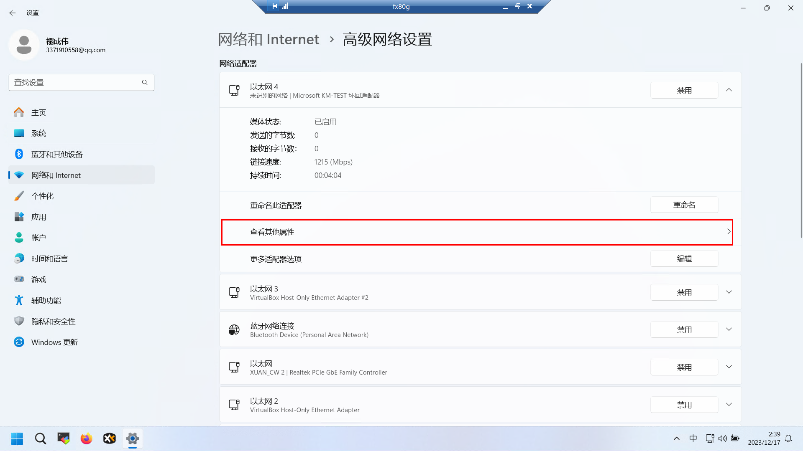

# 摘要

# 环回地址

| 属性     | 值              |
| -------- | --------------- |
| IP 地址  | 192.168.18.10   |
| 子网掩码 | 255.255.255.0   |
| 网关     | 192.168.18.1    |
| 首先DNS  | 8.8.8.8         |
| 备选DNS  | 114.114.114.114 |

 [Windows11添加虚拟环回网卡.html](assets\references\Windows11添加虚拟环回网卡.html) 

