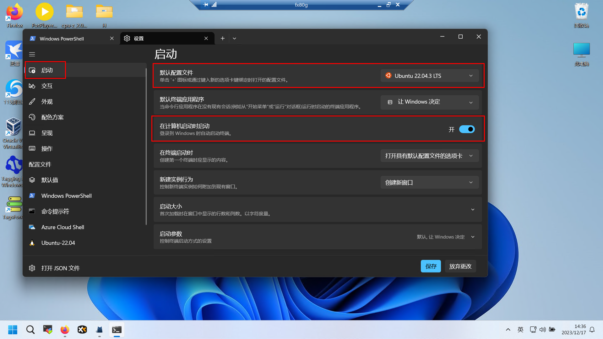
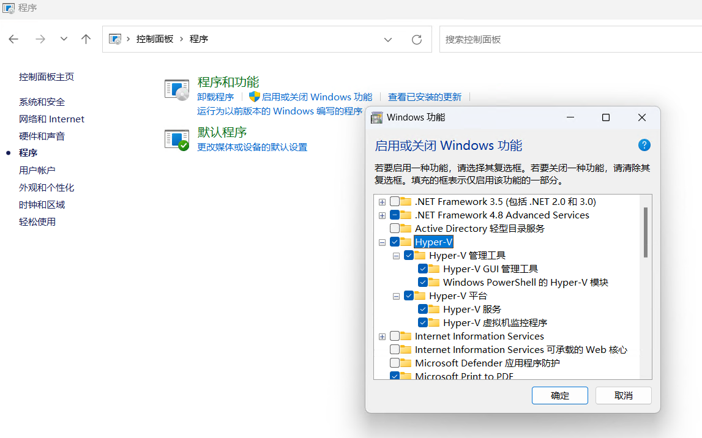
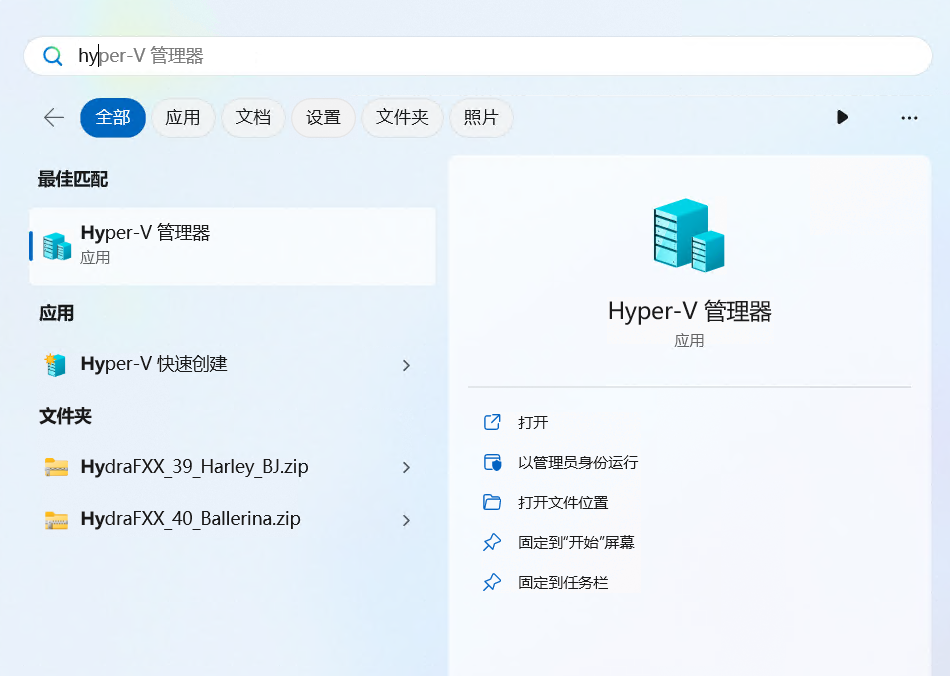

# 摘要


# 安装

https://zhuanlan.zhihu.com/p/475462241

```
wsl --install Ubuntu
```


# 设置

## networkingMode=mirrored

1. Open or create the wsl configuration file (located at `%USERPROFILE%\.wslconfig`),  and enter the following content

```
[experimental]
autoMemoryReclaim=gradual  # gradual  | dropcache | disabled
networkingMode=mirrored
dnsTunneling=true
firewall=true
autoProxy=true
```

2. Open the command prompt and execute `wsl --shutdown`

## 默认启动




## 在终端中打开

 [文件夹下右键在终端打开，希望从当前目录下打开wsl.html](assets\references\文件夹下右键在终端打开，希望从当前目录下打开wsl.html) 


## (暂时无用)启用或关闭Windows功能

控制面板 -> 程序和功能 -> 启用或关闭Windows功能




## (暂时无用)Hyper-V




# 安装docker

https://www.runoob.com/docker/ubuntu-docker-install.html

```
 curl -fsSL https://test.docker.com -o test-docker.sh
 sudo sh test-docker.sh
```

```
sudo curl -L "https://github.com/docker/compose/releases/download/v2.2.2/docker-compose-$(uname -s)-$(uname -m)" -o /usr/local/bin/docker-compose
chmod 777 /usr/local/bin/docker-compose
```


# 测试

## docker

```
sudo docker run -d -p 80:80 --restart=always nginx:1.25
```

## hostname

```
wsl -d Ubuntu hostname -I
```


## curl

```
curl http://localhost:8080
curl http://192.168.18.10:8080

```


 [WIN11 22H2版本 WSL2桥接网络并固定IP方法.html](assets\references\WIN11 22H2版本 WSL2桥接网络并固定IP方法.html) 
