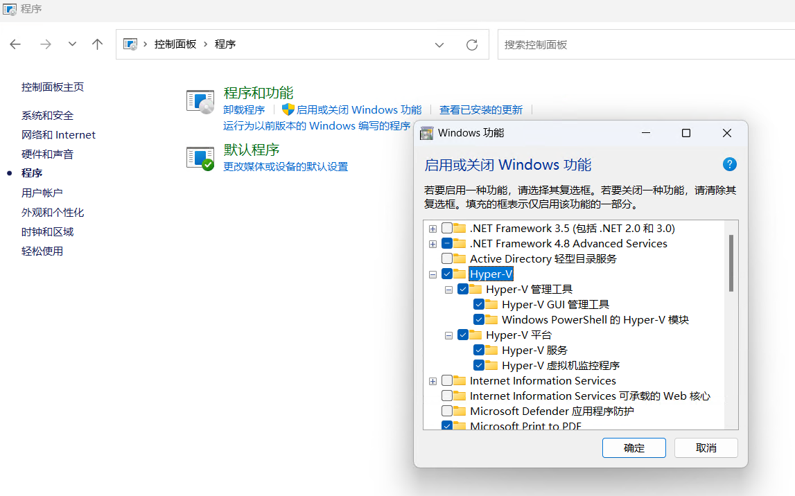

# 摘要


# 安装

# 设置

## 在终端中打开

 [文件夹下右键在终端打开，希望从当前目录下打开wsl.html](assets\references\文件夹下右键在终端打开，希望从当前目录下打开wsl.html) 


## (暂时无用)启用或关闭Windows功能

控制面板 -> 程序和功能 -> 启用或关闭Windows功能




## (暂时无用)Hyper-V


# 测试

## docker

```
sudo docker run -d -p 80:80 --restart=always nginx:1.25
```

## hostname

```
wsl -d Ubuntu hostname -I
```


## curl

```
curl http://localhost:8080
curl http://192.168.18.10:8080

```


