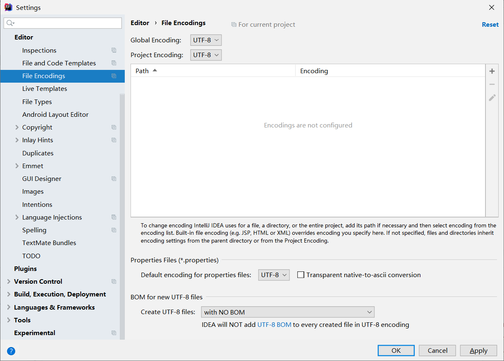
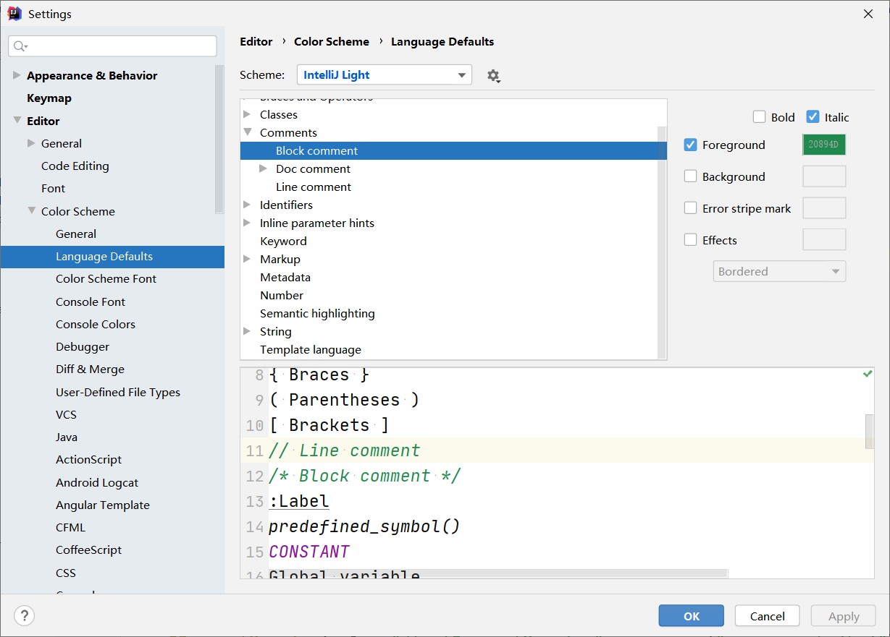
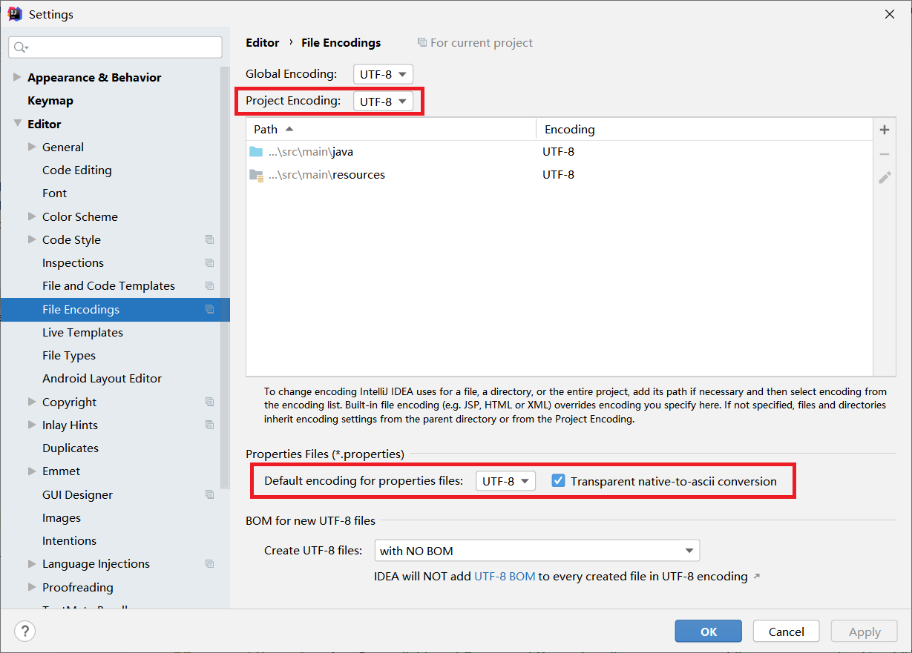
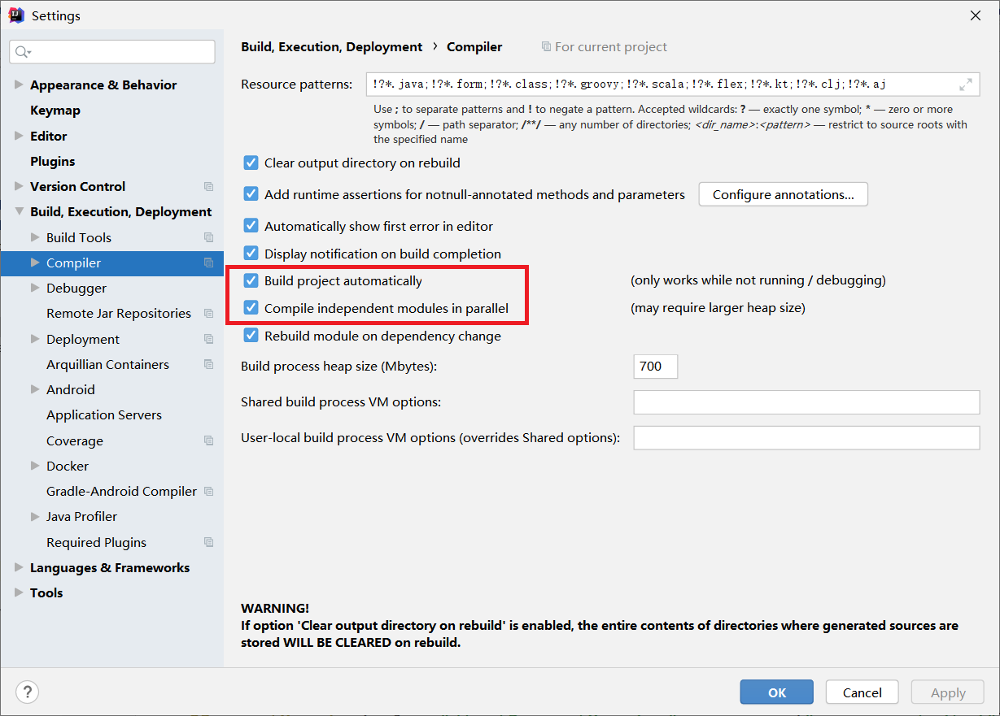
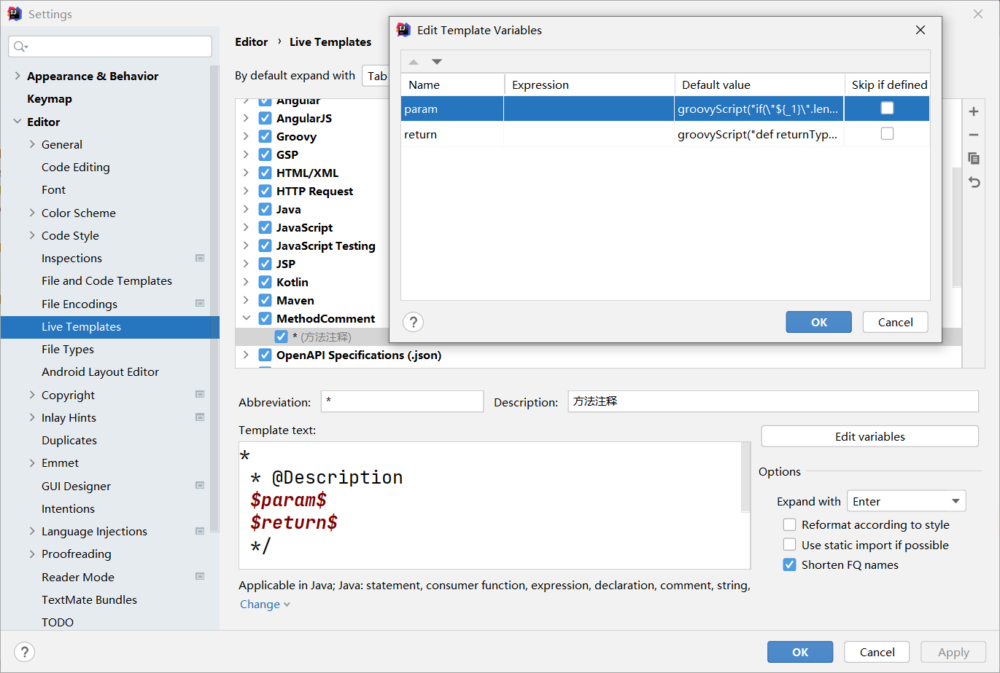

# 字体设置

```
font
```


# 编码设置

```
file encodings
```



# 控制台字体设置

```
Console Font
```


# 模板设置

```
/**
@date ${YEAR}-${MONTH}-${DAY} - ${TIME}
@author 禤成伟
*/
```


# 自动导包


# 多行显示tabs


# 注释颜色

```
20894D
```



```
15559A
```


# 头部信息

```java
/** 
@author 禤成伟
@since ${YEAR}-${MONTH}-${DAY} ${TIME}
*/
```


# 统一设置为 UTF-8



# 自动编译




# 方法注释

## 参考

 [idea设置方法注释](assets\references\idea设置方法注释.html) 

## 三个重要参数

```
* 
 * 
 $param$
 return
 */
```

```
groovyScript("if(\"${_1}\".length() == 2) {return '';} else {def result=''; def params=\"${_1}\".replaceAll('[\\\\[|\\\\]|\\\\s]', '').split(',').toList();for(i = 0; i < params.size(); i++) {if(i==0){result+='* @param ' + params[i]}else{result+='\\n' + ' * @param ' + params[i]}}; return result;}", methodParameters());
```

```
groovyScript("def returnType = \"${_1}\"; def result = '* @return ' + returnType; return result;", methodReturnType());
```



## 作用范围


# 设置 project 显示


# terminal


# Idea使用系统应用打开md文件

我想双击用本地应用打开 markdown 文件，但网上的怎么找都找不到。

我在 idea 中双击 mp4 文件，他就直接本地应用播放了，所以就在想，能让 MP4 直接本地应用打开，那应该也可以让能让 md 直接本地应用打开。

## 添加 mapping

我直接 IDEA 导出  **settings.zip**，解压后检索 `mp4` ,于是在   [settings\options\filetypes.xml](assets\data\filetypes.xml) 中找到了  `mp4`  ：

```xml
<application>
  <component name="FileTypeManager" version="18">
    <extensionMap>
        ... ...
      <mapping ext="mp4" type="Native" />
        ... ...
    </extensionMap>
  </component>
</application>
```

依葫芦画瓢，我添加了一条 `mapping` ，变成了下面这样：

```xml
<application>
  <component name="FileTypeManager" version="18">
    <extensionMap>
        ... ...
      <mapping ext="mp4" type="Native" />
        <mapping ext="md" type="Native" />
        ... ...
    </extensionMap>
  </component>
</application>
```

再打开 idea，发现没卵用，再打开 filetypes.xml ，发现配置的 mapping 消失了，这是因为 IDEA 自带 markdown 插件，我们需要禁用此插件

## 禁用 markdown 插件


# maven指定


# springboot initializr 加速

把原来的

```
https://start.spring.io
```

改成：

```
https://start.aliyun.com/
```

或：

```
https://start.springboot.io/
```

# 插件安装

- Alibaba Java Coding Guidelines
- MyBatisX
- EasyCode
- lombok

# 加大内存

Windows10、idea2021环境下修改 **C:\Program Files\JetBrains\IntelliJ IDEA 2021.2\bin\idea64.exe.vmoptions** 文件

```
-Xmx7500m
-Xms1280m
```

- `-Xmx7500m` JVM初始分配的堆内存
- `-Xms1280m` JVM最大允许分配的堆内存，按需分配

## 参考

 [设置java内存_IDEA设置JVM可分配内存大小和其他参数的教程.html](assets\references\设置java内存_IDEA设置JVM可分配内存大小和其他参数的教程.html) 

 [idea设置java内存.html](assets\references\idea设置java内存.html) 


# 不要扫描 node_modules


# EasyCodeConfig

 [EasyCodeConfig.json](assets\data\EasyCodeConfig.json) 


