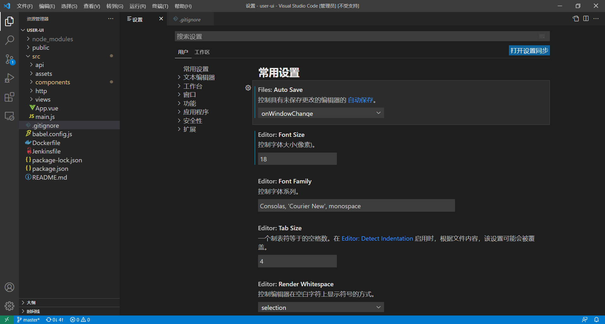

# 概述

# 插件

1. Vetur
2. vue
3. HTML CSS Support
4. Chinese (Simplified) Language Pack for Visual Studio Code
5. Live Server
6. open in browser
7. Auto Close Tag
8. Auto Rename Tag
8. open （使用系统默认的应用打开文件）
8. JavaScript (ES6) code snippets
8. Path Intellisense

# 设置

## 自动保存

## 调整终端控制台字体大小

 [vs code调整终端控制台字体大小.html](assets\references\vs code调整终端控制台字体大小.html) 

## 设置资源管理器字体大小

 [VSCode设置资源管理器字体大小.html](assets\references\VSCode设置资源管理器字体大小.html) 

